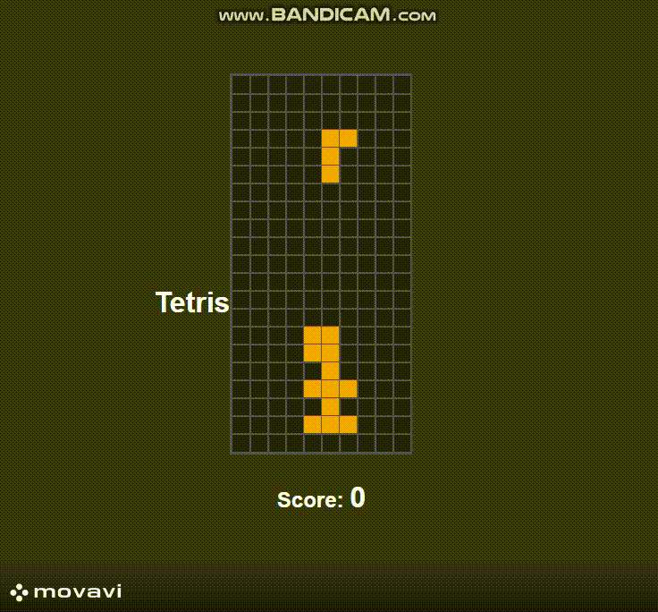

# tetris

## 1일차

#### 문제점 및 보완할 점

1. 맨 왼쪽이나 맨 오른쪽에서 모양을 변경할 경우 오른쪽 끝과 왼쪽 끝으로 모양이 분해가 된다.

2. 맨 아래 띄워져 있는 게 이질감 느낌 -> 이맨 아래 한줄 띄워져 있는 것 없애기.

3. 게임 종료가 되었을 때 새로고침해야하는 불편함 존재 -> 재시작 기능 만들기.

4. 게임 종료가 되었을 때 매 판 점수 기록이 안되는 문제 존재 -> 스코어 점수 남기기

5. 모양이 같아 보는 재미가 없는 문제 존재 -> 모양마다 색깔 다르게 수정하기.

6. 일반적인 테트리스에 있는 일자로 긴 모양이 없음 -> 일자로 긴 모양 추가.